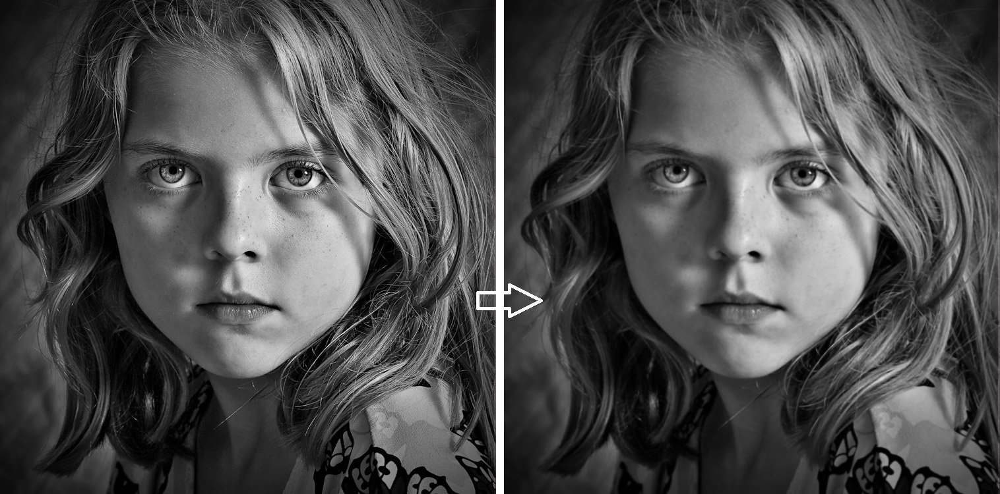

CUDA Image Filters
==================

**University of Pennsylvania, CIS 565: GPU Programming and Architecture, Project 4**

* Yash Vardhan
* Tested on: Windows 10 Pro, Intel i5-4200U (4) @ 2.600GHz 4GB, NVIDIA GeForce 840M 2048MB

In this project, I have implemented a CUDA-based image filters through the use of GPU. I have implemented some awesome Computer Vision image filters like Bilateral Filter and HDR approximation filter(a.k.a. Tone Mapping). More to come soon!

# Features:
* Bilateral Filter
* HDR Approximation Filter
* Toggleable Timer for Performance Analysis

# Results:

Bilateral Filter
----------------
A bilateral filter is a non-linear, edge-preserving, and noise-reducing smoothing filter for images. It replaces the intensity of each pixel with a weighted average of intensity values from nearby pixels. The overall effect of this filter is that sharp edges are preserved, whereas all other elements are smoothed-out.

HDR Approximation Filter (a.k.a Tone Mapper)
--------------------------------------------
This technique is used in image processing and computer graphics to map one set of colors to another to approximate the appearance of high-dynamic-range images in a medium that has a more limited dynamic range. The problem of strong contrast reduction from the scene radiance to the displayable range is addresses while preserving the image details and color appearance important to appreciate the original scene content.

# Performance Analysis:

Bilateral Filter
----------------
The block size was selected at 256 which was found to give the best performance in GPU.

HDR Approximation Filter
------------------------
The block size was selected at 1024 which was found to give the best performance in GPU.

# References:

* [Bilateral Filter](https://en.wikipedia.org/wiki/Bilateral_filter)
* [HDR Approximation Filter](https://en.wikipedia.org/wiki/Tone_mapping)
* [OpenCV API Reference](https://docs.opencv.org/2.4/modules/refman.html)
